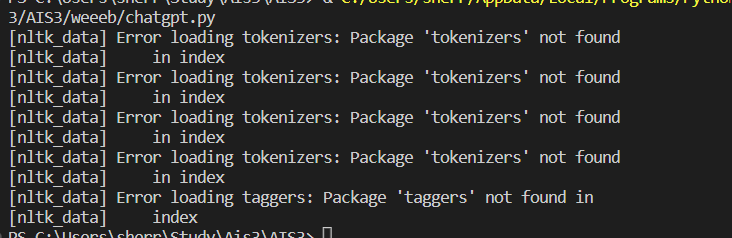

# AI於釣魚郵件辨別之應用
# 檔案
- 📽️Demo link：https://youtu.be/aACeqIV1ORc
- 📝Slides：[I1_final.pdf](I1_final.pdf)
### 參考資料
1. [機器學習分析垃圾&釣魚郵件標頭檔](https://github.com/kregg34/EmailHeaderAnomalyDetection/tree/797406a0bcf44a5d9840e72f3759061d1224f8de)
2. [Learning OpenAI API](https://youtu.be/9AXP7tCI9PI)
3. [OpenAI 專屬助理--網頁部分](https://youtu.be/jTNgTQLa528)
4. [ChatGPT Writer](https://chrome.google.com/webstore/detail/chatgpt-writer-write-mail/pdnenlnelpdomajfejgapbdpmjkfpjkp/related)
5. Detecting Phishing Sites Using ChatGPT-2023/06/09
6. AnomalyDetectioninEmailsusingMachine LearningandHeaderInformation-2022/03/19
7. Phishing by Form: The Abuse of Form Sites-2011/10/18 IEEE

### (2)	專題背景與目的
- Motivation

在上課的時候有提到生成式AI與詐騙的結合 ，這是一個蠻有趣的切入點。
有了這個初步想法並蒐集資料後，我們覺得可以以AI分析URL是否為釣魚網站連結作為主題，釣魚網站連結常出現在資安入侵的攻擊當中，舉凡郵件、簡訊等都常常出現，雖然他的出現歷史已經很悠久了，但是仍然歷久不衰。

另外，透過分析網站連結還有另外一個優點，
釣魚郵件常見的目標都是企業，郵件本身涉及隱私，單純以提交 url 去分析是否為釣魚網站可以保護更好的保護隱私

現有的釣魚網站資料庫，通常是透過人工提交，再一一審核，透過能尋找一個更迅速、即時的方式來做偵測， AI 的應用剛好可以符合需求。我們選擇的是CHAT-3.5
- 尋找資料集
    - ❌[資料集是.raff（attribute-relation file format）檔](https://archive.ics.uci.edu/dataset/327/phishing+websites)
    - ❓[資料集是phishtank，現在不能註冊](https://github.com/zerofox-oss/phishpond)
    - ❓[Monkey.org(Mbox)資料集較舊，新的打不開](https://monkey.org/~jose/phishing/)
    - ⭕[OpenPhish：資料及即時更新:)](https://openphish.com/)
- 初步訓練
  - 爬蟲抓取裡面的 URL 當作基準點(可能有多個 url)，爬取 URL 裡面的HTML ，再利用剛剛寫的簡化 HTML 轉成 .txt 黨傳給 chatGPT讀取裡面的內容，分析是否為釣魚郵件。
- 深度學習
  - 直接給網站一個URL，他會顯示是 safe 或是 warning！並提供分數
  - 監督式學習來標記釣魚網址的特點，優化辨識
- 結尾
  - 利用 Confusion Matrix 比較了我們的自然語言模型與正統機器學習在釣魚郵件辨識方面的準確率
  - 未來可能的研究方向建議
  
### 一鍵搜索資料夾
- Confusion Matrix：計算與挑選模糊矩陣的樣本
- crawl：bug1只抓文字；bug2抓取整個html；craw以firefox引擎為模板；web抓取 html 並截圖已做後續OCR處理
- de-identification：一鍵將儲存資料夾裡的html抓取文本。coool有 meta 值、html、url，有資料夾；lighter沒有 meta 值
- weeeb：如果 chatGPT 無法分析的備案，再傳入URL時將初步訓練的所有步驟全部在後台跑一次
- main：後端訓練
- gpt-master：串接與網站 Demo

### 遭遇問題與解方
- 
  一直沒辦法使用 chatGPT 的機器人，後來跟可以使用的組員比對後發現缺少了一個 persist 資料夾
